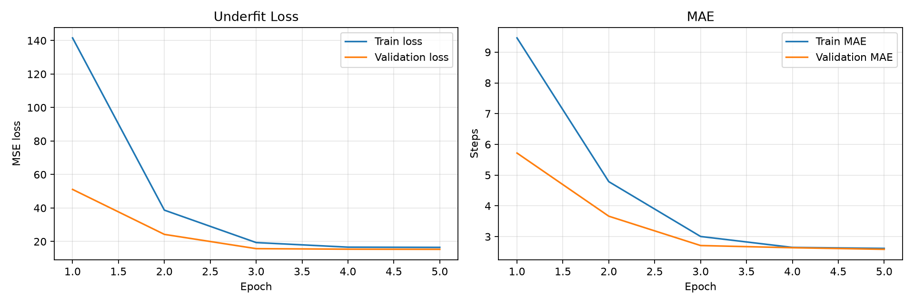
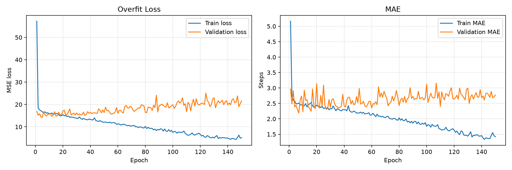
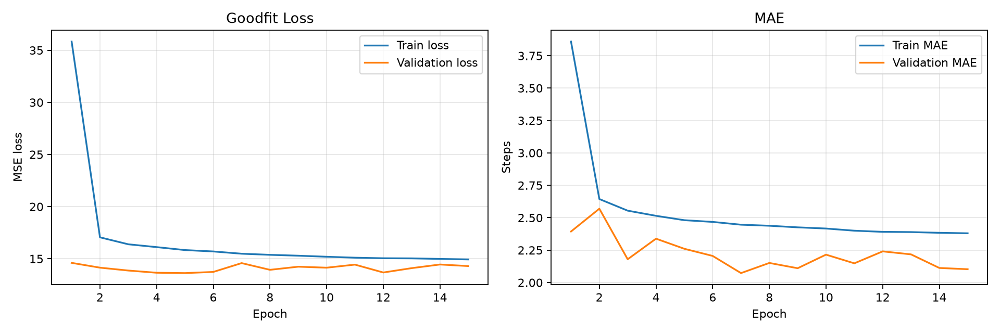
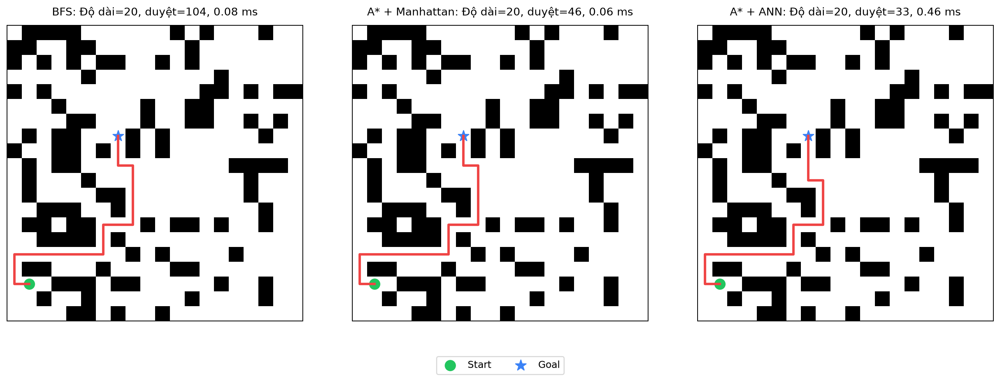

# Maze Pathfinding: A* with Artificial Neural Network (ANN) Heuristic

<p align="center">
  
  
  
</p>

## 1. Giới thiệu (Introduction)

Dự án này là một minh họa trực quan và chuyên sâu về cách ứng dụng **Học máy (Machine Learning)** vào các bài toán tìm kiếm đồ thị cổ điển. Cụ thể, dự án sử dụng **Mạng nơ-ron nhân tạo (ANN)** để học và xấp xỉ một hàm Heuristic cho thuật toán **A*** trong bài toán tìm đường đi ngắn nhất trong mê cung.

Mục tiêu chính của dự án là so sánh hiệu suất, số lượng node được duyệt và thời gian chạy giữa ba phương pháp:
1. **BFS (Breadth-First Search)**: Tìm kiếm mù, duyệt qua tất cả các trạng thái.
2. **A* + Manhattan Heuristic**: Tìm kiếm heuristic kinh điển, sử dụng khoảng cách Manhattan.
3. **A* + ANN Heuristic**: Tìm kiếm heuristic hiện đại, sử dụng mạng nơ-ron để dự đoán chi phí đường đi dựa trên dữ liệu học được.

Dự án cũng đồng thời là một bài thực hành để hiểu các khái niệm trong Machine Learning như: **Training/Validation/Test split, Epoch, Forward propagation, Backpropagation, Overfitting, Underfitting, Dropout, Early Stopping**, và **Cross-validation**.

---

## 2. Cấu trúc Dự án (Project Structure)

```text
maze-ann-a-star/
├── data/                  # Dataset CSV: map ngẫu nhiên, nhãn true_distance do BFS tính
├── models/                # Các file model Keras (.keras) và TensorFlow Lite (.tflite)
├── outputs/               # Biểu đồ loss, metrics, ảnh demo và log kết quả huấn luyện
├── reports/               # Báo cáo và phân tích chuyên sâu
├── slides/                # Tài liệu slide thuyết trình
├── src/                   # Source code chính của dự án
│   ├── config.py          # Cấu hình đường dẫn và hằng số
│   ├── maze.py            # Khởi tạo và thao tác trên lưới mê cung
│   ├── search.py          # Triển khai thuật toán BFS, A* và heuristic Manhattan
│   ├── features.py        # Trích xuất đặc trưng (Feature extraction) từ trạng thái mê cung
│   ├── dataset.py         # Chọn goal, chạy BFS để gán nhãn true_distance
│   ├── generate_dataset.py# Script tự động sinh hàng loạt dataset
│   ├── models.py          # Định nghĩa 3 kiến trúc mạng ANN (Underfit, Overfit, Goodfit)
│   ├── train.py           # Script huấn luyện mô hình
│   ├── cross_validate.py  # Script đánh giá chéo (Cross-validation)
│   ├── heuristics.py      # Tích hợp model TensorFlow Lite thành hàm heuristic cho A*
│   ├── visualize.py       # Render hình ảnh mê cung và vẽ đường đi
│   ├── demo.py            # Chạy so sánh thực tế giữa BFS, A* Manhattan và A* ANN
│   └── ui.py              # UI tương tác: random map, chạy thuật toán, xem path/node
├── requirements.txt       # Các thư viện phụ thuộc
└── README.md              # File tài liệu bạn đang đọc
```

---

## 3. Cơ sở Lý thuyết (Theoretical Background)

### 3.1. Thuật toán A* (A* Algorithm)
A* kết hợp ưu điểm của thuật toán Dijkstra và Greedy Best-First Search. Tại mỗi bước, A* chọn đỉnh $n$ để mở rộng dựa trên hàm đánh giá:

$$ f(n) = g(n) + h(n) $$

Trong đó:
- $g(n)$: Chi phí chính xác từ điểm xuất phát (Start) đến node $n$.
- $h(n)$: **Heuristic** - ước lượng chi phí từ node $n$ đến đích (Goal).

### 3.2. Heuristic Manhattan
Trên lưới ô vuông 4 hướng (lên, xuống, trái, phải) không có vật cản đường chéo, khoảng cách Manhattan là một heuristic **admissible** (luôn ước lượng thấp hơn hoặc bằng thực tế).
Công thức: $h(n) = |x_{current} - x_{goal}| + |y_{current} - y_{goal}|$

### 3.3. Heuristic học bằng ANN
Thay vì dùng công thức toán học cố định, ta huấn luyện một mạng nơ-ron nhận đầu vào là trạng thái của mê cung và dự đoán khoảng cách đến đích. Mạng nơ-ron có thể nắm bắt được sự tồn tại của các bức tường (vật cản) xung quanh để đưa ra dự đoán thực tế hơn so với Manhattan.

### 3.4. Đánh giá mô hình ANN
Với bài toán phân loại, các chỉ số thường gặp là **Accuracy** và **ROC/AUC**. Accuracy đo tỉ lệ dự đoán đúng, còn ROC/AUC cho biết khả năng phân biệt các lớp ở nhiều ngưỡng quyết định. Trong project này, ANN không phân loại mà dự đoán một giá trị số thực là khoảng cách còn lại, nên đây là bài toán **hồi quy (regression)**. Vì vậy, project dùng **MSE** làm loss và **MAE** làm metric chính. MAE có đơn vị là số bước, nên dễ diễn giải: MAE = 2.28 nghĩa là mô hình sai trung bình khoảng 2.28 bước.

Project vẫn dùng **5-fold cross-validation** để kiểm tra độ ổn định của mô hình goodfit qua nhiều cách chia dữ liệu.

---

## 4. Dữ liệu (Dataset)

Để mạng nơ-ron học được khoảng cách, chúng ta cần một tập dữ liệu (dataset) có gán nhãn. Quá trình tạo dữ liệu diễn ra như sau:
1. **Tạo mê cung ngẫu nhiên**: Sinh các lưới 20x20 với vật cản phân bố ngẫu nhiên. BFS không dùng để sinh map.
2. **Gán nhãn (Labeling)**: Với mỗi map, chọn một goal hợp lệ rồi chạy **BFS từ goal** để tính khoảng cách ngắn nhất đến mọi ô reachable. Khoảng cách này là nhãn `true_distance` dùng để huấn luyện ANN.
3. **Trích xuất đặc trưng (Feature Extraction)**: Mỗi trạng thái được chuyển thành một vector gồm 10 chiều:
   - Tọa độ hiện tại: `x`, `y`
   - Tọa độ đích: `goal_x`, `goal_y`
   - Vector hướng: `dx = goal_x - x`, `dy = goal_y - y`
   - Cảm biến tường xung quanh (4 chiều): `up`, `down`, `left`, `right` (giá trị 0 hoặc 1).

---

## 5. Mô hình Học Máy (Machine Learning Models)

Dự án thiết kế sẵn 3 kiến trúc mô hình khác nhau bằng Keras API (`tf.keras`) để so sánh và làm rõ các hiện tượng trong quá trình huấn luyện:

| Tên Thí Nghiệm | Kiến trúc Mạng (Các lớp Dense) | Số Epoch | Dữ liệu Train | Kỹ thuật dùng | Mục đích Minh họa |
| :--- | :--- | :---: | :---: | :--- | :--- |
| **Underfit** | Nhỏ (Input $\to$ 4 $\to$ 1) | 5 | Toàn bộ | Không có | Mô hình quá đơn giản, học ít epoch $\Rightarrow$ Không nắm bắt được quy luật. |
| **Overfit** | Rất Lớn (Input $\to$ 512 $\to$ 512 $\to$ 256 $\to$ 128 $\to$ 1) | 150 | Giới hạn (3,000) | Không có | Mô hình phức tạp, dữ liệu ít, train lâu $\Rightarrow$ "Học vẹt" dữ liệu train, dự đoán kém trên test. |
| **Goodfit** | Vừa phải (Input $\to$ 64 $\to$ Dropout(0.2) $\to$ 32 $\to$ 16 $\to$ 1) | Tối đa 100, dừng ở 20 | Toàn bộ | Dropout, Early Stopping | Cân bằng tốt, chống overfit, dừng sớm khi validation loss không giảm. |

*Hàm loss: Mean Squared Error (MSE) - Metric: Mean Absolute Error (MAE)*

---

## 6. Hướng dẫn Cài đặt & Sử dụng

### 6.1. Cài đặt Môi trường
Khuyến nghị sử dụng Python **3.10, 3.11, hoặc 3.12**.

```bash
# 1. Tạo môi trường ảo
python -m venv .venv
source .venv/bin/activate  # (Với Windows: .venv\Scripts\activate)

# 2. Cập nhật pip và cài đặt thư viện
python -m pip install --upgrade pip
python -m pip install -r requirements.txt
```

### 6.2. Pipeline Chạy Dự án

**Bước 1: Sinh dữ liệu huấn luyện (Generate Dataset)**
Sinh ngẫu nhiên 500 mê cung, dùng BFS để gán nhãn `true_distance`, mỗi mê cung lấy tối đa 200 mẫu. File đầu ra: `data/maze_dataset.csv`.
```bash
python -m src.generate_dataset --mazes 500 --max-samples-per-maze 200
```

**Bước 2: Huấn luyện các Mô hình ANN (Train Models)**
Chạy cả 3 thí nghiệm (underfit, overfit, goodfit). File model sẽ lưu tại thư mục `models/`, lịch sử và logs lưu tại `outputs/`.
```bash
python -m src.train --experiment all
```

**Bước 3: Chạy Đánh giá chéo (Cross-Validation)**
Để kiểm chứng độ ổn định của model, chạy 5-fold cross-validation:
```bash
python -m src.cross_validate --folds 5 --epochs 10
```

**Bước 4: Chạy Demo so sánh các thuật toán (Demo)**
Xem trực quan đường đi của BFS, A* Manhattan và A* ANN trên cùng một mê cung.
```bash
python -m src.demo
```
Kết quả sẽ xuất ra terminal dạng bảng metrics và lưu hình ảnh vào `outputs/demo_path.png`.

**Bước 5: Chạy UI tương tác (Interactive UI)**
Mở cửa sổ điều khiển để random map, chạy từng thuật toán hoặc chạy tất cả. Khi bấm chạy, UI tự động animate quá trình duyệt node, đánh số thứ tự node đã duyệt, sau đó hiển thị đường đi cuối cùng, thời gian và số node.
```bash
python -m src.ui
```

Màu thuật toán trong UI:
- **BFS**: xanh dương
- **A* + Manhattan**: cam
- **A* + ANN**: tím

Phím tắt trong UI:
- `R`: random map mới
- `A`: chạy tất cả thuật toán
- `1`: chạy BFS
- `2`: chạy A* + Manhattan
- `3`: chạy A* + ANN
- `0`: hiển thị đường đi của cả 3 thuật toán
- `C`: xóa kết quả trên map hiện tại

---

## 7. Kết quả & Đánh giá (Results & Evaluation)

### 7.1. Phân tích quá trình Huấn luyện (Training Analysis)

Qua biểu đồ Loss và Metric MAE, ta có thể thấy rõ sự khác biệt của 3 cách tiếp cận:

| Mô hình | Train rows | Validation rows | Test rows | Epochs ran | Test MSE | Test MAE |
| :--- | ---: | ---: | ---: | ---: | ---: | ---: |
| **Underfit** | 70,000 | 15,000 | 15,000 | 5 | 16.322 | 2.669 |
| **Overfit** | 3,000 | 15,000 | 15,000 | 150 | 24.811 | 3.064 |
| **Goodfit** | 70,000 | 15,000 | 15,000 | 20 | **14.300** | **2.284** |

<div align="center">
  <table style="text-align:center;">
    <tr>
      <td><b>Underfit</b></td>
      <td><b>Overfit</b></td>
      <td><b>Goodfit</b></td>
    </tr>
    <tr>
      <td></td>
      <td></td>
      <td></td>
    </tr>
    <tr>
      <td><i>Train/validation loss còn cao sau 5 epoch. Mô hình quá nhỏ nên chưa học đủ quan hệ trong dữ liệu.</i></td>
      <td><i>Train loss giảm mạnh nhưng validation loss tăng cao về cuối. Đây là dấu hiệu học quá kỹ tập train nhỏ.</i></td>
      <td><i>Validation loss ổn định hơn và test MAE thấp nhất. Dropout + EarlyStopping giúp mô hình tổng quát tốt hơn.</i></td>
    </tr>
  </table>
</div>

### 7.2. Kết quả Cross-Validation (Mô hình Goodfit)
*Trung bình sau 5 folds, 10 epoch/fold:*
- **MAE**: ~2.223 (sai số trung bình khoảng 2.2 bước đi)
- **MSE**: ~14.859

### 7.3. So sánh Thuật toán (Demo Path)

Kết quả khi đưa 3 thuật toán vào chạy chung một màn chơi:
- **Khởi điểm (Start)**: `(17, 1)`
- **Đích đến (Goal)**: `(7, 7)`

| Thuật toán | Tìm thấy đường | Chiều dài đường đi | Số Node Mở Rộng | Thời gian chạy |
| :--- | :---: | :---: | :---: | :---: |
| **BFS** | Có | 20 | 104 | ~0.09 ms |
| **A* + Manhattan** | Có | 20 | 46 | ~0.07 ms |
| **A* + ANN (Goodfit)** | Có | 20 | **33** | ~0.48 ms* |

*(Ghi chú: Mô hình được huấn luyện bằng Keras và export thêm sang TensorFlow Lite để suy luận trong demo A*.)*

**Hình ảnh Demo kết quả tìm đường:**

<p align="center">
  
</p>
<p align="center"><i>(Đường màu đỏ mô tả lộ trình tìm được. Start màu xanh lá, Goal màu xanh dương.)</i></p>

**Nhận xét:**
- **BFS** duyệt một lượng lớn node vì nó tìm kiếm mù theo mọi hướng.
- **A* Manhattan** định hướng tốt hơn, giảm hơn 50% số node so với BFS.
- **A* ANN** cho hiệu quả định hướng tốt nhất trong demo, **số node cần duyệt là ít nhất**. Hàm heuristic ANN học từ vị trí, khoảng cách tương đối và tín hiệu tường lân cận, nên có thể ưu tiên node khác với Manhattan.

---

## 8. Minh bạch sử dụng AI

AI được dùng để hỗ trợ tạo khung code ban đầu, gợi ý cách tổ chức báo cáo và hỗ trợ debug lỗi cú pháp/môi trường. Các phần cần nắm vững gồm: cách sinh map ngẫu nhiên, cách BFS gán nhãn `true_distance`, thiết kế input/output của ANN, cách dùng Keras (`tf.keras`), lý do chia train/validation/test và cách đọc đồ thị loss/MAE.

---

## 9. Ứng dụng & Hướng Phát Triển (Future Work)

**Ý nghĩa:** Dự án này là công cụ giảng dạy/học tập cực tốt để giải thích vì sao cần Machine Learning, tác hại của Underfit/Overfit, và vai trò của Heuristic trong Trí tuệ nhân tạo (AI).

**Gợi ý phát triển tiếp:**
- Huấn luyện với mê cung kích thước đa dạng và phức tạp hơn (ví dụ Maze sinh bởi thuật toán DFS, Prim).
- Áp dụng mạng **CNN (Convolutional Neural Network)** nhận đầu vào trực tiếp là ảnh/ma trận mê cung 2D cục bộ thay vì vector 1D thủ công.
- Export mô hình sang `.tflite` (đã áp dụng) hoặc `ONNX` để tăng tốc độ inference.
- So sánh thêm với biến thể **Weighted A***.
- Xây dựng giao diện Web/GUI (Pygame/Streamlit) để người dùng có thể tự vẽ tường và xem thuật toán chạy trực tiếp.

---
*Dự án thực hiện nhằm mục đích học tập & nghiên cứu thuật toán AI cơ bản. Chúc bạn có những trải nghiệm thú vị khi khám phá kết hợp giữa Search Algorithms và Machine Learning!*
